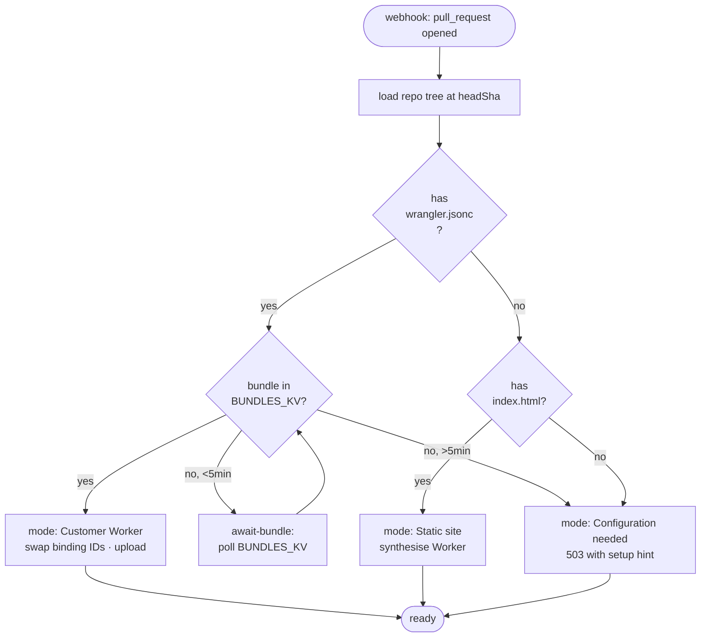
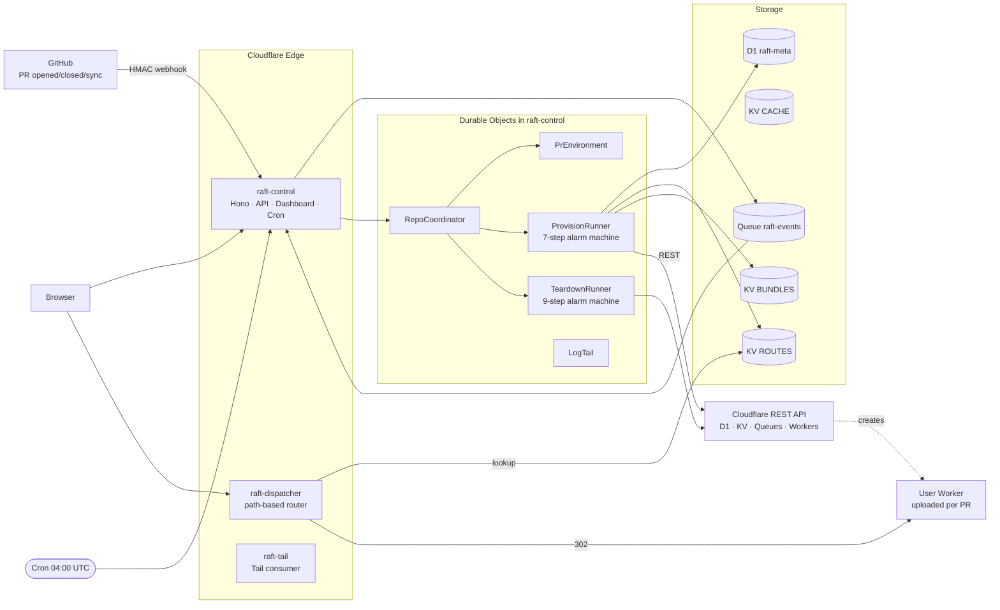
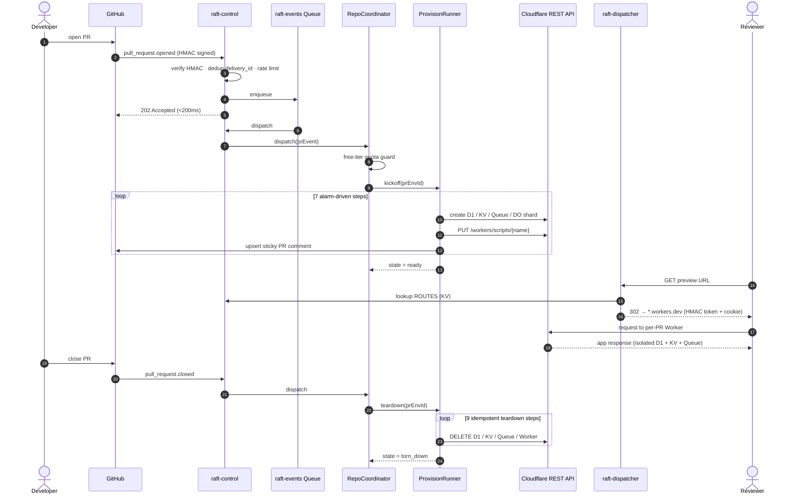
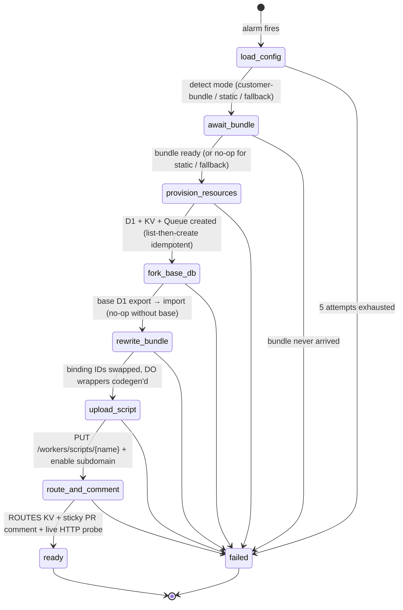
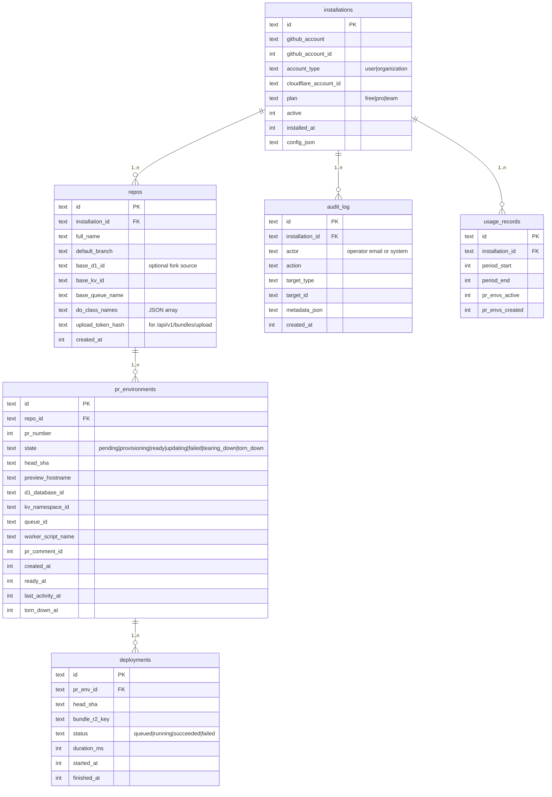

# Raft

**Per-PR preview environments for Cloudflare Workers projects.**

A GitHub App that, on every pull request, provisions a fully isolated Cloudflare stack — D1 + KV + Queue + Durable Object shard + a deployed Worker — comments the preview URL on the PR, and tears it all down when the PR closes. End-to-end on the Cloudflare free tier.

— [Live dashboard](https://raft-control.adityakammati3.workers.dev) · [PRD](./rift_PRD.md) · [Submission write-up](./SUBMISSION.md) · v0.2.0

---

## Why this exists

Every modern web platform — Vercel, Netlify, Render, Fly — gives reviewers a unique URL for every pull request. Cloudflare Workers does not. Reviewing a Workers PR today means picking one of three bad options:

1. **Pull the branch and `wrangler dev` locally.** Slow context switch, no shareable URL, no real bindings, breaks every reviewer workflow that relies on stakeholders clicking a link.
2. **Share one staging Worker.** Concurrent PRs collide on the same D1 / KV / Queue. One reviewer's writes corrupt another reviewer's read.
3. **Build your own per-PR provisioner.** Nobody does this — the orchestration around durable retries, idempotent resource creation, binding rewrites, and quota guarding is genuinely hard.

The Cloudflare community has been asking for this since 2022 ([workers-sdk #2701](https://github.com/cloudflare/workers-sdk/issues/2701)). Raft is the answer, designed from the ground up around Cloudflare primitives no other cloud has.

## What Raft does (the user-facing flow)

1. A team installs the **Raft GitHub App** on a Cloudflare Workers repository.
2. A developer opens a pull request.
3. Raft receives the webhook, dedups it on `delivery_id`, enqueues it, and returns `202` in under 200ms.
4. A `RepoCoordinator` Durable Object claims the PR, runs free-tier quota checks, and starts a `ProvisionRunner`.
5. The runner executes a 7-step alarm-driven machine: detect deployment mode → wait for the customer's bundle (or synthesise one for static sites) → create D1 + KV + Queue + DO shard → optionally fork the base D1 database → rewrite binding IDs in the bundle → upload the Worker script → write the dispatcher route and post a sticky PR comment with the preview URL.
6. A reviewer clicks the URL. The `raft-dispatcher` Worker resolves the path to the per-PR Worker via an HMAC-gated token and 302-redirects them in. They see a fully isolated environment — their writes never touch staging.
7. When the PR is closed or merged, a `TeardownRunner` runs a 9-step alarm machine that destroys every resource and confirms each deletion against the Cloudflare REST API.

End-to-end measured: **<2 seconds** PR-opened to ready preview URL · **<30 seconds** PR-closed to all resources deleted · **$0/mo** to operate.

## Who is this for

- **Workers teams reviewing PRs in pairs / trios.** Replace "merge to staging and pray" with click-and-review.
- **Open-source Workers maintainers.** Let drive-by contributors share a working preview without granting them deploy access.
- **Internal tools / dashboards built on Workers.** Stakeholder review without standing up per-environment infra.
- **Static-site repos hosted on Workers.** Zero customer setup — Raft synthesises a Worker that serves the inlined files.

## Three deployment modes

Raft auto-detects which mode applies by inspecting the repo at `headSha`:

| Mode                     | Trigger                                                                                 | What it deploys                                                                | Customer setup                                                             |
| ------------------------ | --------------------------------------------------------------------------------------- | ------------------------------------------------------------------------------ | -------------------------------------------------------------------------- |
| **Customer Worker**      | Repo has `wrangler.{jsonc,json,toml}` and the Raft GitHub Action uploads a built bundle | The customer's actual Worker code with binding ids swapped to per-PR resources | One-time: paste `.github/workflows/raft-bundle.yml` (provided on Settings) |
| **Static site**          | Repo has `index.html` under `/`, `/public`, `/dist`, `/build`, or `/site`               | A synthesised Worker that serves the inlined files (HTML / CSS / JS / images)  | None — install the GitHub App and push                                     |
| **Configuration needed** | Neither of the above                                                                    | A Worker that returns HTTP 503 with an actionable setup message                | None — surfaces what to configure                                          |



All three modes are end-to-end verified against real Cloudflare resources.

---

## Architecture

Three Workers participate. `raft-control` is the brain (webhooks, API, dashboard, cron, every Durable Object). `raft-dispatcher` is the path-based router that 302-redirects reviewers into per-PR Workers. `raft-tail` is a Tail consumer scaffolded for paid-tier upgrade.



### Why three Workers, not one

| Worker            | Responsibility                                                                                                                                         | Why split out                                                                                                          |
| ----------------- | ------------------------------------------------------------------------------------------------------------------------------------------------------ | ---------------------------------------------------------------------------------------------------------------------- |
| `raft-control`    | GitHub webhook ingress, Hono REST API, dashboard SPA, cron sweep, every Durable Object class, GitHub App auth, Cloudflare REST client, audit log writes | Single trust boundary for everything that holds secrets and writes to D1.                                              |
| `raft-dispatcher` | One path-based route. Looks up `ROUTES` KV, validates the per-scope HMAC token, 302s to the per-PR `*.workers.dev` URL.                                | Hot path for every reviewer click. Kept as small as possible so it stays cold-start-cheap and never holds App secrets. |
| `raft-tail`       | Consumes user-Worker `tail()` events into `raft-tail-events` Queue, fan out to `LogTail` DO.                                                           | Tail consumers must be a separate Worker per Cloudflare's binding model.                                               |

### Cloudflare products used

| Product                  | Used for                                                                           |
| ------------------------ | ---------------------------------------------------------------------------------- |
| Workers                  | `raft-control`, `raft-dispatcher`, `raft-tail`                                     |
| Workers Static Assets    | Dashboard SPA hosted inside `raft-control`                                         |
| Durable Objects (SQLite) | `RepoCoordinator`, `PrEnvironment`, `ProvisionRunner`, `TeardownRunner`, `LogTail` |
| D1                       | `raft-meta` for installations, repos, PR envs, audit                               |
| KV                       | Session cache (`CACHE`), dispatcher routes (`ROUTES`), bundle blobs (`BUNDLES_KV`) |
| Queues                   | Decouple webhook ingress from provisioning                                         |
| Cron Triggers            | Daily idle-environment sweep                                                       |
| Hibernatable WebSockets  | Live runner-state stream to dashboard tabs                                         |
| Workers Logs             | Operator log access via per-PR deep-links                                          |

### Why this can only exist on Cloudflare

Three Cloudflare-only primitives make this product possible. **No other cloud has the equivalent of any of them.**

1. **D1 export/import REST API** lets us fork a database in seconds without copying storage at the block layer. This is the foundation of per-PR data isolation — without it, every reviewer would either share a staging DB or wait minutes for a logical dump.
2. **Direct `PUT /workers/scripts/{name}`** lets one account host hundreds of per-PR user scripts as a free-tier substitute for Workers for Platforms. AWS Lambda, GCP Cloud Functions, Vercel — none expose a scriptable per-tenant deploy primitive at this layer.
3. **DO Alarms with SQLite-backed storage** give us durable, retryable, idempotent step machines on the free tier. We get the semantics of Cloudflare Workflows (per-step caching, exponential backoff, replay safety) without paying for them.

---

## End-to-end PR lifecycle

The full path from a developer pushing "Open PR" to a reviewer clicking the preview, then the cleanup on close.



### Provision lifecycle in detail

Seven idempotent steps, alarm-driven, exponential backoff (`1 → 2 → 4 → 8 → 16s`, max 5 attempts). Each step writes its result into DO storage so re-runs on alarm replay short-circuit. Per-step start / finish timestamps are persisted, so the dashboard latency chart reflects truth.



**Key design decision: idempotent list-then-create.** Step 3 (`provision-resources`) handles three different "name already exists" responses (D1 returns 400+7502, KV returns 400+10014, Queue returns 409+11009) by always listing first. If the resource exists, reuse the ID; if not, create. A re-run after a partial failure picks up where it left off — never double-creates, never orphans.

### Teardown lifecycle

Nine idempotent steps. Cloudflare returning 404 is treated as success (already gone), so re-runs after a partial teardown are safe.

```mermaid
stateDiagram-v2
  [*] --> mark_tearing_down --> delete_worker_script --> delete_d1 --> delete_kv --> delete_queue --> purge_bundle_kv --> evict_do_shard --> clear_route --> mark_torn_down --> [*]
```

---

## Storage model

Four D1 tables back the operator dashboard and the runners' state machines. SQLite-backed Durable Objects hold per-PR runtime state (cursor, step cache, timings).



---

## Engineering trade-offs

The PRD targets two paid Cloudflare products; Raft substitutes both with thin abstractions, so swapping back to paid is a binding-type change.

| PRD calls for                   | Raft ships                                                                                                             | Trade-off                                                        |
| ------------------------------- | ---------------------------------------------------------------------------------------------------------------------- | ---------------------------------------------------------------- |
| Workers for Platforms           | `PUT /workers/scripts/{name}` per PR + dispatcher 302 to `*.workers.dev` (HMAC-signed `?raft_t=` token + cookie)       | Cap of 100 scripts per account                                   |
| Cloudflare Workflows            | `ProvisionRunner` / `TeardownRunner` Durable Objects with alarm-driven step machines + per-step caching                | Equivalent semantics; bonus: state introspectable from dashboard |
| Cloudflare Access               | Signed `raft_session` cookie (HMAC-SHA256) for the operator dashboard; per-scope HMAC token gates static-site previews | Single-operator demo auth + per-PR token                         |
| R2 for bundles                  | `BUNDLES_KV` (JSON-encoded bundle keyed by `bundle:{install}:{repo}:{headSha}`)                                        | KV value cap 24 MB (well above typical bundle size)              |
| Logpush                         | Workers Logs + per-PR deep-link from dashboard                                                                         | Lose 30-day R2 retention                                         |
| Wildcard custom-domain previews | Path-based dispatcher → 302 → workers.dev                                                                              | Less pretty, still demoable                                      |

---

## Verified

|                                         | Result                                                                     |
| --------------------------------------- | -------------------------------------------------------------------------- |
| Customer-Worker provision (real PR)     | `state=ready` in **<2s** end-to-end                                        |
| Static-site provision (real PR)         | `state=ready` in **<2s** end-to-end                                        |
| Teardown (real PR closed)               | `state=torn_down` in **<30s**                                              |
| CF resources after teardown             | D1 / KV / Queue / Worker → all `404`                                       |
| Webhook dedup on replayed `delivery_id` | `200` + `dedup:true` (no double-provision)                                 |
| Sticky PR comment                       | Edited in place via embedded HTML marker — never duplicated                |
| Tests                                   | 105 / 105 across 25 files (vitest-pool-workers)                            |
| TypeScript                              | `strict + noUncheckedIndexedAccess + exactOptionalPropertyTypes`, no `any` |
| File / function caps                    | <300 / <40 lines (ESLint-enforced)                                         |

---

## Quick start

```bash
nvm use && corepack enable
pnpm install
pnpm typecheck && pnpm test     # 105/105
pnpm --filter @raft/control dev # http://localhost:8787
```

## Deploy to your own Cloudflare account

See [`CONFIG_CHECKLIST.md`](./CONFIG_CHECKLIST.md) for the full setup. Short version:

```bash
./infra/scripts/bootstrap.sh                                      # create D1 + KV + Queues
pnpm --filter @raft/control exec wrangler d1 migrations apply raft-meta --remote
for s in SESSION_SIGNING_KEY GITHUB_WEBHOOK_SECRET GITHUB_APP_PRIVATE_KEY \
         INTERNAL_DISPATCH_SECRET CF_API_TOKEN; do
  pnpm --filter @raft/control exec wrangler secret put $s
done
pnpm --filter @raft/control run deploy
pnpm --filter @raft/dispatcher run deploy
pnpm --filter @raft/tail run deploy
```

## Operator access

The dashboard is gated by a signed-cookie session. Sign in at `/login` with:

- **Operator email** — any string (audit-logged on every action)
- **Session key** — must match the `SESSION_SIGNING_KEY` secret

The cookie is HMAC-signed, `Secure; HttpOnly; SameSite=Lax`, 7-day TTL. Rotate by uploading a new secret and re-deploying — existing sessions invalidate immediately. Production swaps this for Cloudflare Access (one route handler change).

---

## Repository layout

```
apps/
  control/          raft-control Worker (the brain)
    src/
      do/           Durable Object classes
      lib/          GitHub client, CF client, static-site synth, crypto, logging
      middleware/   auth, rate limiting, request id
      queue/        raft-events consumer
      routes/       Hono route handlers (api, dashboard-api, auth, webhooks)
      runner/       provision/ + teardown/ step machines
      scheduled/    daily cron sweep + alerting
    migrations/     D1 schemas
    tests/          unit + integration (vitest-pool-workers)
  dispatcher/       raft-dispatcher Worker (path-based router)
  tail/             raft-tail Worker (Tail consumer)
  dashboard/        CRA + craco SPA, served by raft-control via Static Assets
packages/
  shared-types/     Result<T,E>, ApiOk/ApiErr, error codes
  tsconfig/         shared TypeScript configs
  eslint-config/    shared ESLint flat config (file/function caps + no-any)
infra/scripts/      bootstrap script (idempotent CF resource creation)
```

---

## Future scope

The free-tier substitutions remain on the production roadmap; each is a binding-type change away.

### Near-term (unblocks bigger customers)

- **Workers for Platforms** — replace `PUT /workers/scripts/{name}` with a dispatch-namespace upload. Removes the 100-scripts-per-account ceiling and unlocks untrusted-mode isolation for OSS contributor PRs.
- **Cloudflare Workflows** — port the two `Runner` DOs to Workflows when the product GAs. The step-cursor + per-step-cache abstraction was designed to make this a one-file swap.
- **R2 for bundles** — move `BUNDLES_KV` blobs to R2; cache base-D1 exports there too so repeated forks within the same SHA don't re-export.

### Medium-term (production-grade auth & multi-tenancy)

- **Cloudflare Access SSO** for the operator dashboard, replacing the signed-cookie demo auth.
- **Per-installation Cloudflare API tokens.** Today every install shares one operator's CF token; production demands customer-scoped tokens stored in Workers Secrets per install.
- **Wildcard custom-domain previews** via Total TLS — `pr-123.preview.customer.com` instead of `*.workers.dev` paths.

### Long-term (product completeness)

- **Containers-based builder** so customers don't need to add `.github/workflows/raft-bundle.yml` themselves. Raft would clone the repo, run their build, and upload the bundle from inside its own Container.
- **Logpush + R2 retention** for the operator log viewer once the customer is on a paid CF plan.
- **Smart base-DB seeding** — let customers point at a tagged D1 snapshot (or a SQL dump in R2) as the per-PR seed instead of always forking the latest base.
- **GitHub Checks API integration** — fail the PR check if the preview HTTP probe is not 200, so reviewers don't waste time clicking dead links.

## License

Portfolio submission. All rights reserved.
