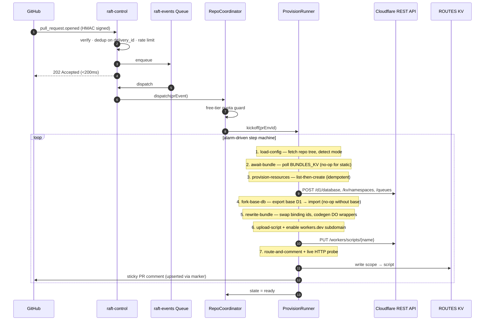

# Raft

**Per-PR preview environments for Cloudflare Workers projects.** A GitHub App that, on every pull request, provisions an isolated Cloudflare stack — D1, KV, Queue, Durable Object shard, deployed Worker — and tears it down on close. Built end-to-end on the Cloudflare free tier.

— [Live dashboard](https://raft-control.adityakammati3.workers.dev) · [PRD](./rift_PRD.md) · [Submission write-up](./SUBMISSION.md) · v0.2.0

---

## Three deployment modes

Raft auto-detects which mode applies by inspecting the repo at `headSha`:

| Mode | Trigger | What it deploys | Customer setup |
|---|---|---|---|
| **Customer Worker** | Repo has `wrangler.{jsonc,json,toml}` and the Raft GitHub Action uploads a built bundle | The customer's actual Worker code with binding ids swapped to per-PR resources | One-time: paste `.github/workflows/raft-bundle.yml` (provided on Settings) |
| **Static site** | Repo has `index.html` under `/`, `/public`, `/dist`, `/build`, or `/site` | A synthesised Worker that serves the inlined files (HTML / CSS / JS / images) | None — install the GitHub App and push |
| **Configuration needed** | Neither of the above | A Worker that returns HTTP 503 with an actionable setup message | None — surfaces what to configure |

All three end-to-end verified against real Cloudflare resources. Three Workers participate: `raft-control` (webhooks, API, dashboard, cron, every Durable Object), `raft-dispatcher` (path-based router that 302-redirects through an HMAC-gated query token), and `raft-tail` (Tail consumer scaffolding for paid-tier upgrade).

---

## Architecture


### Cloudflare products

| Product | Used for |
|---|---|
| Workers | `raft-control`, `raft-dispatcher`, `raft-tail` |
| Workers Static Assets | Dashboard SPA hosted inside `raft-control` |
| Durable Objects (SQLite) | `RepoCoordinator`, `PrEnvironment`, `ProvisionRunner`, `TeardownRunner`, `LogTail` |
| D1 | `raft-meta` for installations, repos, PR envs, audit |
| KV | Session cache (`CACHE`), dispatcher routes (`ROUTES`), bundle blobs (`BUNDLES_KV`) |
| Queues | Decouple webhook ingress from provisioning |
| Cron Triggers | Daily idle-environment sweep |
| Hibernatable WebSockets | Live runner-state stream to dashboard tabs |
| Workers Logs | Operator log access via per-PR deep-links |

---

## Provision lifecycle

Seven idempotent steps, alarm-driven, exponential backoff (`1 → 2 → 4 → 8 → 16s`, max 5 attempts). Per-step start / finish timestamps are persisted, so the dashboard latency chart reflects truth.



## Teardown lifecycle

Nine idempotent steps; CF returning 404 = already gone = success.

```mermaid
stateDiagram-v2
  [*] --> mark_tearing_down --> delete_worker_script --> delete_d1 --> delete_kv --> delete_queue --> purge_bundle_kv --> evict_do_shard --> clear_route --> mark_torn_down --> [*]
```

---

## Verified

| | Result |
|---|---|
| Customer-Worker provision (real PR) | `state=ready` in **<2s** end-to-end |
| Static-site provision (real PR) | `state=ready` in **<2s** end-to-end |
| Teardown (real PR closed) | `state=torn_down` in **<30s** |
| CF resources after teardown | D1 / KV / Queue / Worker → all `404` |
| Webhook dedup on replayed `delivery_id` | `200` + `dedup:true` (no double-provision) |
| Sticky PR comment | Edited in place via embedded HTML marker — never duplicated |
| Tests | 105 / 105 across 25 files (vitest-pool-workers) |
| TypeScript | `strict + noUncheckedIndexedAccess + exactOptionalPropertyTypes`, no `any` |
| File / function caps | <300 / <40 lines (ESLint-enforced) |

---

## Engineering choices

The PRD targets two paid Cloudflare products; Raft substitutes both with thin abstractions, so swapping back to paid is a binding-type change.

| PRD calls for | Raft ships | Trade-off |
|---|---|---|
| Workers for Platforms | `PUT /workers/scripts/{name}` per PR + dispatcher 302 to `*.workers.dev` (HMAC-signed `?raft_t=` token + cookie) | Cap of 100 scripts per account |
| Cloudflare Workflows | `ProvisionRunner` / `TeardownRunner` Durable Objects with alarm-driven step machines + per-step caching | Equivalent semantics; bonus: state introspectable from dashboard |
| Cloudflare Access | Signed `raft_session` cookie (HMAC-SHA256) for the operator dashboard; per-scope HMAC token gates static-site previews | Single-operator demo auth + per-PR token |
| R2 for bundles | `BUNDLES_KV` (JSON-encoded bundle keyed by `bundle:{install}:{repo}:{headSha}`) | KV value cap 24 MB (well above typical bundle size) |
| Logpush | Workers Logs + per-PR deep-link from dashboard | Lose 30-day R2 retention |
| Wildcard custom-domain previews | Path-based dispatcher → 302 → workers.dev | Less pretty, still demoable |

---

## Quick start

```bash
nvm use && corepack enable
pnpm install
pnpm typecheck && pnpm test     # 105/105
pnpm --filter @raft/control dev # http://localhost:8787
```

## Deploy to your own Cloudflare account

See [`CONFIG_CHECKLIST.md`](./CONFIG_CHECKLIST.md) for the full setup. Short version:

```bash
./infra/scripts/bootstrap.sh                                      # create D1 + KV + Queues
pnpm --filter @raft/control exec wrangler d1 migrations apply raft-meta --remote
for s in SESSION_SIGNING_KEY GITHUB_WEBHOOK_SECRET GITHUB_APP_PRIVATE_KEY \
         INTERNAL_DISPATCH_SECRET CF_API_TOKEN; do
  pnpm --filter @raft/control exec wrangler secret put $s
done
pnpm --filter @raft/control run deploy
pnpm --filter @raft/dispatcher run deploy
pnpm --filter @raft/tail run deploy
```

## Operator access

The dashboard is gated by a signed-cookie session. Sign in at `/login` with:

- **Operator email** — any string (audit-logged on every action)
- **Session key** — must match the `SESSION_SIGNING_KEY` secret

The cookie is HMAC-signed, `Secure; HttpOnly; SameSite=Lax`, 7-day TTL. Rotate by uploading a new secret and re-deploying — existing sessions invalidate immediately. Production swaps this for Cloudflare Access (one route handler change).

---

## Repository layout

```
apps/
  control/          raft-control Worker (the brain)
  dispatcher/       raft-dispatcher Worker (path-based router)
  tail/             raft-tail Worker (Tail consumer)
  dashboard/        CRA + craco SPA, served by raft-control via Static Assets
packages/
  shared-types/     Result<T,E>, ApiOk/ApiErr, error codes
  tsconfig/         shared TypeScript configs
  eslint-config/    shared ESLint flat config (file/function caps + no-any)
infra/scripts/      bootstrap script (idempotent CF resource creation)
```

## Roadmap

The free-tier substitutions remain on the production roadmap; each is a binding-type change away.

- Workers for Platforms for unbounded script count and untrusted-mode isolation
- Cloudflare Workflows in place of the Durable Object alarm runners
- Cloudflare Access SSO for the operator dashboard
- R2 for bundle storage and base-D1 export caching
- Wildcard custom-domain previews via Total TLS
- Per-installation Cloudflare API tokens for true multi-tenancy
- Containers-based builder so customers don't need to add a workflow

## License

Portfolio submission. All rights reserved.
