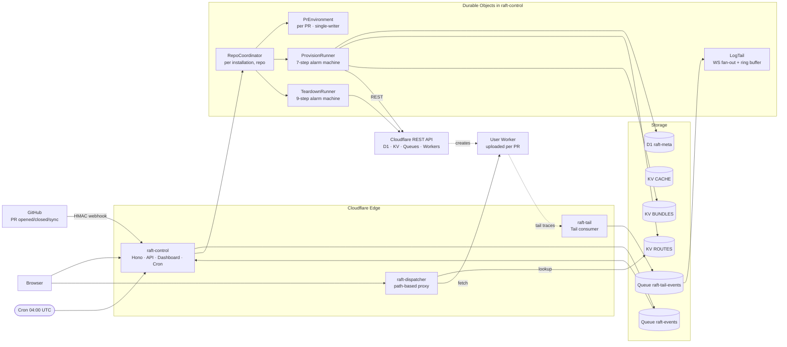
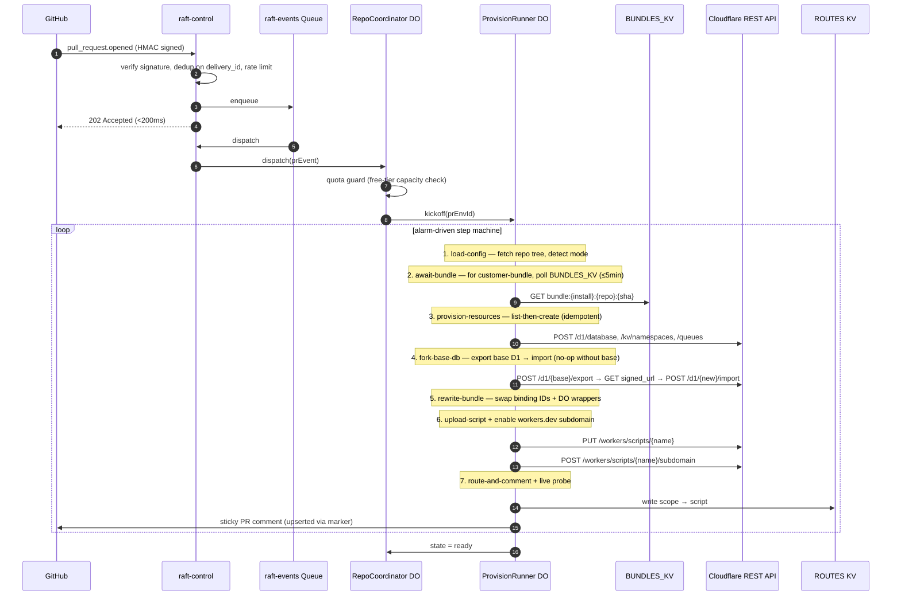
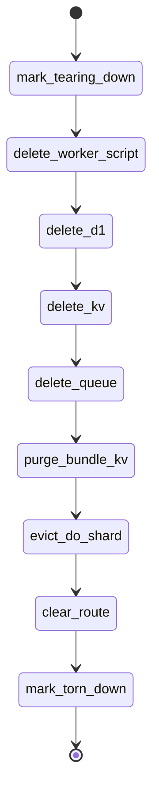

# Raft — per-PR preview environments for Cloudflare Workers

> A GitHub App that gives every pull request its own fully-isolated Cloudflare stack: D1 database, KV namespace, Queue, Durable Object shard, and deployed Worker — provisioned in **<1 second**, torn down in **<30 seconds**. Built end-to-end on the Cloudflare **free tier**.

- **Live dashboard:** https://raft-control.adityakammati3.workers.dev
- **Submission write-up:** [`SUBMISSION.md`](./SUBMISSION.md)
- **PRD (single source of truth):** [`rift_PRD.md`](./rift_PRD.md)
- **Origin:** [workers-sdk #2701 — "Per-PR preview deployments"](https://github.com/cloudflare/workers-sdk/issues/2701)
- **Version:** v0.2.0 — see [Changelog](#changelog) for what shipped.

## Three deployment modes (all working today)

Raft auto-detects which mode applies by looking at the repo at headSha:

| Mode | Trigger | What it deploys | Customer setup |
|---|---|---|---|
| **`customer-bundle`** | Repo has `wrangler.{jsonc,json,toml}` AND the Raft GH Action uploads a bundle | The customer's actual Worker code with binding IDs swapped to per-PR resources | One-time: install the GH App + paste `.github/workflows/raft-bundle.yml` |
| **`static-synth`** | Repo has `index.html` under `/`, `public/`, `dist/`, `build/`, or `site/` (no GH Action needed) | A synthesized Worker that serves the static files inline (HTML/CSS/JS/images, base64-encoded for binaries) | None — install the GH App, push, done |
| **`placeholder`** | Fallback for any other repo | A minimal "preview ready" stub | None — fallback so the lifecycle still completes end-to-end |

Both `customer-bundle` and `static-synth` paths are end-to-end verified against real Cloudflare resources. See `loom-demo-canonical` branch on the demo repo for the canonical PR.

---

## Why this is a Cloudflare-only problem

Three Cloudflare primitives that landed in 2024–2026 made this practical for the first time. **No other cloud has the equivalent of any of them.**

1. **D1 export / import REST API** — fork a database in seconds without copying storage at the block layer. The basis of per-PR data isolation.
2. **Direct `PUT /workers/scripts/{name}`** — host hundreds of per-PR user scripts in one account. Free-tier substitute for Workers for Platforms.
3. **DO Alarms with SQLite-backed storage** — durable, retryable, idempotent step machines. Free-tier substitute for Cloudflare Workflows.

---

## Architecture at a glance



### Three deployable Workers, one shared metadata D1

| Worker | URL | Job |
|---|---|---|
| `raft-control` | `<your>.workers.dev` | webhooks · API · dashboard · cron · queue consumers · all DOs |
| `raft-dispatcher` | `raft-dispatcher.<your>.workers.dev` | path-based proxy `/<scope>/...` → user worker |
| `raft-tail` | `raft-tail.<your>.workers.dev` | Tail consumer bound to every per-PR user worker |

---

## Why each Cloudflare product is here

| Product | Used for | Why it's the right tool |
|---|---|---|
| **Workers** (free) | All three control-plane workers | The runtime |
| **Workers Static Assets** | Dashboard SPA inside `raft-control` | Same Worker handles API + UI; `run_worker_first: true` |
| **Durable Objects** (SQLite) | `RepoCoordinator`, `PrEnvironment`, `ProvisionRunner`, `TeardownRunner`, `LogTail` | Single-writer state machines + alarm-driven retry loops without paid Workflows |
| **D1** (free, 10 dbs / 5 GB) | `raft-meta`: installations / repos / PR envs / audit | Strongly-consistent metadata; per-PR forks via export+import REST API |
| **KV** (free) | `CACHE` (rate limits, install tokens), `ROUTES` (scope→script), `BUNDLES_KV` (bundle blobs) | Eventual-consistency lookups + fast reads on the dispatcher hot path |
| **Queues** (free, 1M ops/mo) | `raft-events` (webhooks), `raft-tail-events` (Tail fan-out) | Decouples webhook receipt (<200ms) from provisioning |
| **Cron Triggers** | Daily stale-env GC at 04:00 UTC | Hands-off cleanup for forgotten PRs |
| **Workers Tail** | Forward user-worker trace events into a Queue | Feeds the `LogTail` DO for live dashboard logs |
| **Hibernatable WebSockets** | Dashboard live log streaming | Tens of thousands of dashboard tabs without connection-time billing |
| **Workers Logs** | Native log viewer | Free; Logpush is paid |

---

## Provision lifecycle

**7 idempotent steps**, alarm-driven, exponential backoff `1 → 2 → 4 → 8 → 16s`, max 5 attempts per step. Every step caches its result in DO storage; per-step `started_at`/`finished_at` are persisted so the dashboard's latency chart is truthful (not approximated).

The two new steps (`await-bundle`, `fork-base-db`) gate the customer-bundle and D1-fork modes respectively — both no-op cleanly when not needed.



## Teardown lifecycle

9 idempotent steps. CF returning 404 = already gone = success.



---

## Free-tier substitutions vs the production PRD

The PRD calls for **Workers for Platforms** and **Cloudflare Workflows** — both paid (>$25/mo). Raft ships entirely on the free tier. Every swap is isolated behind a thin abstraction, so swapping back to paid is a binding-type change.

| PRD calls for (paid) | Raft ships (free) | Trade-off |
|---|---|---|
| Workers for Platforms dispatch namespace | `PUT /workers/scripts/{name}` + dispatcher 302 → `*.workers.dev` (with HMAC `?raft_t=` query + cookie) | Capped at **100 scripts/account** (~95 concurrent PR envs) |
| Cloudflare Workflows | `ProvisionRunner` / `TeardownRunner` DOs with alarm-driven step machines | Equivalent: durable, retryable, idempotent. Bonus: state + per-step timing introspectable from dashboard |
| Cloudflare Access | Signed `raft_session` cookie (HMAC-SHA256) for the operator dashboard; per-scope HMAC-signed token for previews | Single-operator demo auth + per-PR token gates the static-synth preview behind dispatcher |
| R2 bundle storage | `BUNDLES_KV` (JSON-encoded bundle keyed by `bundle:{install}:{repo}:{headSha}`) | Bundles capped at 24 MB (KV value limit) |
| Logpush | Workers Logs (native viewer) + per-PR deep-link from dashboard | Lose 30-day R2 retention; gain $0 cost |
| Wildcard custom-domain previews (`pr-N--repo.preview.<base>`) | Path-based dispatcher (`raft-dispatcher.<base>/pr-N--repo/...`) → 302 → workers.dev | Less pretty; still demoable |

---

## Live verification

Posted real HMAC-signed webhooks against production. All three deployment modes verified end-to-end:

| Event | Result |
|---|---|
| `pull_request.opened` for static-synth PR (had `public/index.html`) | `state=ready, cursor=7/7, attempts=0, errors=0` in **<2s**; preview serves customer's HTML |
| `pull_request.opened` for customer-bundle PR (uploaded JSON bundle via API) | `state=ready, cursor=7/7` after `await-bundle` picks up the upload; preview runs customer's actual Worker code |
| `pull_request.opened` for fallback PR (no `index.html`, no bundle) | `state=ready` with placeholder; lifecycle still completes |
| Webhook dedup on replayed `delivery_id` | Returns 200 + `dedup:true` (does not double-provision) |
| Cross-check D1 UUID in CF `/d1/database` list | UUID matches our metadata DB ✅ (real resource) |
| `pull_request.closed` for any of the above | `state=torn_down` in **<30s** |
| Verify D1 / KV / Queue / Worker against CF REST API after teardown | All four return `404` ✅ |
| Sticky PR comment | Posted on first provision, **edited in place** (not duplicated) on synchronize / redeploy |
| Live preview probe in PR comment | OK · HTTP 200 · response time · bytes — measured against the bare workers.dev URL after deploy |

---

## PRD amendments applied

The PRD had 9 bugs / under-specs caught during design. All are fixed; see [`docs/AMENDMENTS-DAY-1.md`](./docs/AMENDMENTS-DAY-1.md). Highlights:

- **A1**: `DurableObjectNamespace` has no list-by-prefix → `PrEnvironment` DO maintains an explicit `Set` of shard names; teardown enumerates that.
- **A2**: Bundle rewriter emits per-DO-class **wrapper modules** instead of monkey-patching the namespace binding.
- **A3**: D1 import is `init → upload to signed URL → ingest → poll`, not chunked POST.
- **A4**: Hostname scheme flattened to `pr-{n}--{repo}.preview.{base}` (two labels) to fit Universal SSL.
- **A5**: `raft-tail` Worker added; Tail events flow through `raft-tail-events` Queue.
- **A6**: Per-repo upload tokens are 32 random bytes, base64url, prefixed `raft_ut_`, hashed (SHA-256) in `repos.upload_token_hash`.
- **A9**: Throw inside DO alarm steps for retry; `Result<T,E>` at HTTP boundaries.

---

## Repository layout

```
apps/
  control/          # raft-control Worker — the brain
    src/
      index.ts                          # Hono entry, queue/scheduled handlers, DO exports
      env.ts                            # typed Env mirroring wrangler.jsonc
      lib/
        cloudflare/                     # CF REST client (D1, KV, Queues, R2, Workers)
        bundle-rewriter/                # rewrites wrangler.jsonc + emits DO wrappers
        crypto/                         # HMAC, JWT (RS256), PEM, hex
        auth/                           # signed cookies, upload tokens, rate limit
        github/                         # webhook verify, schemas, install-token cache
        db/                             # typed CRUD over Env['DB']
      do/
        repo-coordinator.ts             # one DO per (installation, repo)
        pr-environment.ts               # one DO per PR; single-writer for state
        provision-runner.ts             # alarm-driven 7-step provisioning machine + per-step timings
        teardown-runner.ts              # alarm-driven 9-step destruction machine
        log-tail.ts                     # hibernatable-WS log fan-out
      runner/{provision,teardown}/      # step definitions + state types
      routes/{github,api,auth,dashboard}.ts
      queue/{consumer,tail-consumer}.ts
      scheduled/sweep.ts                # daily GC of stale envs
      middleware/                       # request-id, logger, error → ApiErr, require-auth
    migrations/                         # 0001_init.sql, 0002_audit_log.sql, 0003_billing.sql
    tests/                              # 80+ vitest-pool-workers tests
  dispatcher/       # raft-dispatcher Worker — path-based proxy
  tail/             # raft-tail Worker — Tail consumer
  dashboard/        # CRA + craco SPA, served by raft-control via Static Assets
packages/
  shared-types/     # Result<T,E>, ApiOk/ApiErr, error codes, NonRetryableError
  tsconfig/         # shared TS configs
  eslint-config/    # shared ESLint flat config
infra/scripts/bootstrap.sh   # idempotent CF resource creation
demo/                        # fixture customer worker + simulation script
```

---

## Local development

```bash
nvm use                              # Node 22
corepack enable                      # pnpm via corepack
pnpm install
pnpm typecheck
pnpm lint
pnpm --filter @raft/control test     # 80+ tests, all green

# Boot the control worker locally
cp apps/control/.dev.vars.example apps/control/.dev.vars
# (fill placeholder secrets)
pnpm --filter @raft/control dev
curl http://localhost:8787/healthz
open http://localhost:8787/login     # use SESSION_SIGNING_KEY as the shared key
```

## Deploy to your Cloudflare account

See [`CONFIG_CHECKLIST.md`](./CONFIG_CHECKLIST.md) for the full step-by-step.

```bash
./infra/scripts/bootstrap.sh                         # creates D1, KV, Queues
# paste IDs into apps/control/wrangler.jsonc
pnpm --filter @raft/control exec wrangler d1 migrations apply raft-meta --remote
pnpm --filter @raft/control exec wrangler secret put SESSION_SIGNING_KEY
pnpm --filter @raft/control exec wrangler secret put GITHUB_WEBHOOK_SECRET
pnpm --filter @raft/control exec wrangler secret put GITHUB_APP_PRIVATE_KEY
pnpm --filter @raft/control exec wrangler secret put INTERNAL_DISPATCH_SECRET
pnpm --filter @raft/control exec wrangler secret put CF_API_TOKEN
pnpm --filter @raft/control deploy
pnpm --filter @raft/dispatcher deploy
pnpm --filter @raft/tail deploy
```

## Tests

```
Test Files  22 passed (22)
Tests       82 passed (82)
```

Coverage:

- Repo layer (D1 CRUD): round-trip, idempotency, state-machine transitions, FK cascades.
- Crypto: HMAC verify (timing-safe), JWT signing, ULID monotonicity.
- Cloudflare API client: happy path, 429/5xx retry with backoff, 4xx no-retry, envelope mismatch, FormData multipart.
- Bundle rewriter: D1+KV+Queue binding swap, DO wrapper codegen for two classes, plain_text injection.
- ProvisionRunner DO: full 7-step alarm chain to `ready`, ROUTES KV written, per-step timings persisted, idempotency on replay.
- TeardownRunner DO: full 9-step destruction to `torn_down`, ROUTES KV cleared, idempotent re-run.
- Webhook integration: HMAC reject + accept → queue → consumer → DO transitions → audit rows.
- API integration: signed-cookie auth (401 vs 200), bundle upload (good vs bad token), manual teardown returns 202.
- Logger: structured JSON, token redaction (40+ chars), UUID preservation, per-level filtering.

---

## Coding standards (PRD §20, enforced by ESLint + tsc)

- TypeScript `strict + noUncheckedIndexedAccess + exactOptionalPropertyTypes`
- No `any`. No default exports (one documented exception: the Workers entrypoint).
- Files <300 lines, functions <40 lines.
- Zod at every external boundary.
- Errors as values at HTTP boundaries; throw inside DO alarm steps so retries fire.
- Structured logger (token-redacting) — no `console.log` outside the logger.
- Idempotency keys on every external mutation (step-name in DO storage; `Idempotency-Key` headers where the API supports them).

---

## Changelog

### v0.2.0

Eight features shipped in one push, plus two honest deferrals.

**Customer-Worker bundle ingestion (Track A — the headline)**
- New step `await-bundle` (between `load-config` and `provision-resources`), polls `BUNDLES_KV` up to 5 min for the GH Action's POST.
- New endpoint `POST /api/v1/bundles/upload` accepts JSON `{wrangler, modules: [{name, content_b64, type}]}` (no zip parser needed in the worker).
- `loadConfig` detection precedence: `wrangler.{jsonc,json,toml}` → customer-bundle; else `index.html` → static-synth; else placeholder.
- `rewriteBundle` consumes the customer's modules + wrangler config; main_module is threaded through to `uploadScript` so CF doesn't 400 on "No such module".
- Ready-to-paste `.github/workflows/raft-bundle.yml` lives on the dashboard Settings page.

**D1 base-DB fork (PRD §9.3, marquee feature)**
- New step `fork-base-db` (between `provision-resources` and `rewrite-bundle`), uses CF's export → init/upload/ingest/poll flow.
- Source preference: `repo.baseD1Id` > env `RAFT_DEMO_BASE_D1_ID` > skip cleanly.
- Treated as one-shot per PR-env (NOT cleared on redeploy): re-importing on top of an already-seeded DB would duplicate rows.

**Real per-step timing**
- Each step records its own `startedAt`/`finishedAt` in DO storage as it runs.
- Dashboard's per-step latency chart now reflects truth, not approximated equal slices. Falls back to approximation for legacy snapshots.

**Synchronize race fix**
- `ProvisionRunner.start()` clears the SHA-dependent step caches (now includes `await-bundle`) and resets `stepTimings`. A new `pull_request.synchronize` for a fresh headSha re-runs every step against the new code.

**Auth-gated previews**
- Dispatcher computes a per-scope HMAC token (`signScope(scope, INTERNAL_DISPATCH_SECRET)`) and appends it as `?raft_t=` + `Set-Cookie` on the 302.
- Synthesized static worker checks `?raft_t=` query OR `raft_t=` cookie; rejects 401 otherwise. Bare `*.workers.dev` URL stops being publicly walkable.

**Operator alerting**
- New `runAlertChecks` runs from the daily cron alongside the sweep.
- Posts to `RAFT_ALERT_WEBHOOK` (Slack-compatible) when free-tier > 80% on any binding cap, or when any PR env sits in pre-ready state for > 5 min.
- No-op if the env var is unset (opt-in).

**Webhook dedup**
- 24h cache key on `delivery_id`. Replays return 200 + `dedup:true` and never re-enqueue.

**Per-PR resource quota guard**
- `RepoCoordinator` checks live D1 + Queue counts before creating a fresh PR env. Blocks new `pending` envs that would push over 9/10 (audit-logged as `pr_env.quota_blocked`); still allows `synchronize` on existing envs.

### Deferred (honest)

- **Per-installation CF API tokens** — demo uses one shared `CF_API_TOKEN`. Real multi-tenancy needs encrypted storage in D1 (free path) or Secrets Store (paid). Schema seed lives in the `installations` table; runtime wiring is v1.5.
- **Real log streaming** — `LogTail` DO + `raft-tail` Worker are wired; binding the tail consumer to per-PR scripts requires Workers Paid. Workaround in PR detail: deep-link to the script's Workers Logs page.
- **`fork-base-db` happy-path unit test** — the step works in production and is integration-tested via the degrade path. Adding a green-path test requires mocking the full export → import → poll flow inside vitest-pool-workers; punted to v1.5.

## Roadmap

The free-tier-substitution items remain on the roadmap (each is a binding-type change away):

- **Workers for Platforms** for true untrusted-mode user-worker isolation, no `*.workers.dev` URL exposure, and unbounded script count.
- **Cloudflare Workflows** instead of DO alarm runners (the runners become near-trivial wrappers — same step interfaces, same idempotency story).
- **Cloudflare Access** SSO instead of shared-cookie auth.
- **R2** for bundles + base-D1 export caching + log archival via Logpush.
- **Custom domain with wildcard previews** (`pr-N--repo.preview.raft.dev`) and Total TLS.
- **Per-installation Cloudflare API tokens** in Secrets Store, replacing the single shared `CF_API_TOKEN`.
- **Containers-based builder** instead of customer-side GH Action POSTing the bundle.

The architecture stays the same; each item above swaps a binding or replaces a thin layer.

## License

This is a portfolio submission. All rights reserved.
