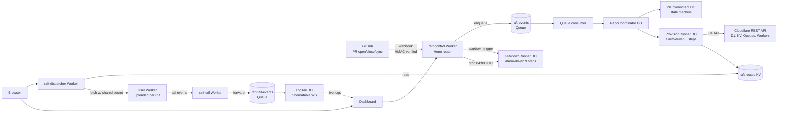

# Raft — per-PR preview environments, Cloudflare-native

Raft is a GitHub App that, on every pull request, automatically provisions a
fully isolated preview environment for a Cloudflare Workers app: its own D1
database, its own KV namespace, its own Queue, an isolated DO shard prefix,
and a freshly-uploaded copy of the customer's user worker. The preview is
reachable at a stable per-PR URL. When the PR closes, every resource is torn
down. A nightly cron sweeps anything left behind.

This repo is the v1 implementation, built end-to-end on Cloudflare's free tier.

> The Cloudflare Workers SDK issue that motivated this:
> [workers-sdk#2701 — "Per-PR preview deployments"](https://github.com/cloudflare/workers-sdk/issues/2701).

## Why this is a Cloudflare-native problem

Three Cloudflare primitives that landed in 2024–2026 made this practical:

1. **D1 export/import REST API** — fork a database in seconds (no copy of storage).
2. **Direct Workers script PUT** — upload an isolated user worker per PR.
3. **One-click Cloudflare Access for `*.workers.dev`** — SSO-gate the dashboard without manual configuration.

No competitor (Vercel, Netlify, Render, Fly) ships an equivalent stack —
none have D1 export/import or DO sharding.

## Architecture



**Three deployable Workers + one shared metadata D1:**

| Worker | URL | Job |
|---|---|---|
| `raft-control` | `<your>.workers.dev` | webhooks, API, dashboard, cron, queue consumer, all DOs |
| `raft-dispatcher` | `raft-dispatcher.<your>.workers.dev` | path-based proxy `/<scope>/...` → user worker's `*.workers.dev` |
| `raft-tail` | `raft-tail.<your>.workers.dev` | Tail consumer bound to every per-PR user worker |

## Why each Cloudflare product is here

| Product | Used for | Why it's the right tool |
|---|---|---|
| Workers (free) | All three control-plane workers | The runtime |
| Durable Objects (SQLite-backed) | RepoCoordinator, PrEnvironment, ProvisionRunner, TeardownRunner, LogTail | Single-writer state machines + alarm-driven retry loops without paid Workflows |
| D1 (free, 10 dbs / 5 GB) | `raft-meta` for installations / repos / PR envs / audit / billing | Strongly-consistent metadata; per-PR forks via export+import REST API |
| KV (free) | `CACHE` (rate limits, install tokens), `ROUTES` (host→script), `BUNDLES_KV` (bundle blobs) | Eventual-consistency lookups + fast reads in the dispatcher hot path |
| Queues (free, 1M ops/mo) | `raft-events` (webhooks), `raft-tail-events` (Tail Worker fan-out) | Decouples webhook receipt (<200ms) from provisioning |
| Cron Triggers | Daily stale-env GC at 04:00 UTC | Hands-off cleanup for forgotten PRs |
| Tail Workers | Forward user-worker trace events into our Queue | Integrates with the LogTail DO for live dashboard logs |
| Hibernatable WebSockets | Dashboard live log streaming | Tens of thousands of concurrent dashboard tabs without paid connection-time billing |
| Workers Logs (`observability.enabled`) | Native log viewer | Free, immediate, no Logpush needed |

## Free-tier substitutions vs the production PRD

The PRD ([`rift_PRD.md`](./rift_PRD.md)) calls for **Workers for Platforms** and
**Cloudflare Workflows**. Both are paid (>$25/mo). For this submission, Raft
runs entirely on the free tier with the following swaps — every one is
isolated behind a thin abstraction so swapping back is a binding-type change:

| PRD calls for | Raft v1 ships | Trade-off |
|---|---|---|
| Workers for Platforms dispatch namespace | **Direct `PUT /workers/scripts/{name}` + `*.workers.dev` URL with shared-secret header** | WfP gives untrusted-mode isolation; the free-tier path relies on the customer's own code being trusted (which it is — they wrote it). Capped at **100 scripts/account** so demo supports ~95 concurrent PR envs. |
| Cloudflare Workflows | **`ProvisionRunner` / `TeardownRunner` Durable Objects** with alarm-driven step machines | Equivalent semantics: durable, retryable steps with idempotency keyed by step name in DO storage, exponential backoff (1/2/4/8/16s), `NonRetryableError` short-circuits to compensating teardown. Bonus: full state introspectable from the dashboard. |
| Cloudflare Access | **Signed `raft_session` cookie** issued by `/login` against `SESSION_SIGNING_KEY` | One-operator demo auth. Production should re-introduce Access. |
| R2 buckets for bundle storage | **`BUNDLES_KV`** (KV blob, base64) | Bundles capped at 24 MB (KV value limit). Production switches back to R2. |
| Logpush for log archival | **Workers Logs (native viewer)** + Analytics Engine for app-level events | Lose 30-day R2 retention; gain $0 cost. |
| Custom-domain wildcard previews (`pr-N--repo.preview.<base>`) | **Path-based dispatcher URL** (`raft-dispatcher.<your>.workers.dev/pr-N--repo/...`) | Less pretty; still demoable. Production restores wildcards via Total TLS or ACM. |

## PRD amendments applied

The PRD had nine bugs / under-specs that we caught during design. All are
fixed in this implementation; see [`docs/AMENDMENTS-DAY-1.md`](./docs/AMENDMENTS-DAY-1.md)
for the verbatim list. Highlights:

- **A1**: DurableObjectNamespace has no list-by-prefix → each PR's PrEnvironment DO maintains an explicit Set of shard names; teardown enumerates that.
- **A2**: Bundle rewriter emits per-DO-class **wrapper modules** instead of prototype monkey-patching the namespace binding.
- **A3**: D1 import is `init → upload to signed URL → ingest → poll`, not chunked POST.
- **A4**: Hostname scheme flattened to `pr-{n}--{repo}.preview.{base}` (two labels) to fit Universal SSL.
- **A5**: `raft-tail` Worker added; Tail events go through the `raft-tail-events` Queue.
- **A6**: Per-repo upload tokens are 32 random bytes, base64url, prefixed `raft_ut_`, hashed (SHA-256) in `repos.upload_token_hash`.
- **A9**: Throw inside DO alarm steps for retry; `Result<T,E>` at HTTP boundaries.

## Repository layout

```
apps/
  control/         # raft-control Worker — the brain
    src/
      index.ts                        # Hono entry, queue/scheduled handlers, DO exports
      env.ts                          # typed Env mirroring wrangler.jsonc
      lib/
        cloudflare/                   # CF REST client (D1, KV, Queues, R2, Workers)
        bundle-rewriter/              # rewrites customer wrangler.jsonc + emits DO wrappers
        crypto/                       # HMAC, JWT (RS256), PEM, hex
        auth/                         # signed cookies, upload tokens, rate limit
        github/                       # webhook verify, schemas, install-token cache
        db/                           # typed CRUD over Env['DB']
        ids.ts                        # ULID
        logger.ts                     # structured logger w/ token redaction
      do/
        repo-coordinator.ts           # one DO per (installation, repo); state machine + dispatch
        pr-environment.ts             # one DO per PR; single-writer for state transitions
        provision-runner.ts           # alarm-driven 5-step provisioning machine
        teardown-runner.ts            # alarm-driven 9-step destruction machine
        log-tail.ts                   # hibernatable-WS log fan-out
      runner/
        provision/                    # step definitions + state types
        teardown/
      routes/
        github.ts                     # POST /webhooks/github
        api.ts                        # /api/v1/* (cookie-auth)
        auth.ts                       # /login, /logout
        dashboard.ts                  # /, /dashboard/prs/:id
      queue/
        consumer.ts                   # raft-events handler
        tail-consumer.ts              # raft-tail-events handler
      scheduled/
        sweep.ts                      # daily GC of stale envs
      middleware/                     # request-id, structured logger, error → ApiErr, require-auth
    migrations/                       # 0001_init.sql, 0002_audit_log.sql, 0003_billing.sql
    tests/
      unit/                           # 60+ vitest-pool-workers unit tests
      integration/                    # webhook → DO, ProvisionRunner, TeardownRunner, API, log-tail
  dispatcher/      # raft-dispatcher Worker — path-based proxy
  tail/            # raft-tail Worker — Tail consumer
  dashboard/       # static placeholder; live pages are server-rendered from control
packages/
  shared-types/    # Result<T,E>, ApiOk/ApiErr, error codes, CodedError, NonRetryableError
  tsconfig/        # Shared TS configs
  eslint-config/   # Shared ESLint flat config (no any, no default exports, file/function caps)
infra/
  scripts/
    bootstrap.sh   # idempotent CF resource creation
demo/              # fixture customer worker + simulation script (Slice J)
```

## Local development

```bash
nvm use                              # Node 22
corepack enable                      # pnpm via corepack
pnpm install
pnpm typecheck
pnpm lint
pnpm --filter @raft/control test     # 80+ tests, all green

# Boot the control worker locally
cp apps/control/.dev.vars.example apps/control/.dev.vars
# (fill in placeholder secrets)
pnpm --filter @raft/control dev
curl http://localhost:8787/healthz
open http://localhost:8787/login     # use the SESSION_SIGNING_KEY value as the shared key
```

## Deploy to your Cloudflare account

See [`CONFIG_CHECKLIST.md`](./CONFIG_CHECKLIST.md) for the step-by-step.
Short version:

```bash
./infra/scripts/bootstrap.sh                          # creates D1, KV, Queues
# paste IDs into apps/control/wrangler.jsonc
pnpm --filter @raft/control exec wrangler d1 migrations apply raft-meta --remote
pnpm --filter @raft/control exec wrangler secret put SESSION_SIGNING_KEY
pnpm --filter @raft/control exec wrangler secret put GITHUB_WEBHOOK_SECRET
pnpm --filter @raft/control exec wrangler secret put GITHUB_APP_PRIVATE_KEY
pnpm --filter @raft/control exec wrangler secret put INTERNAL_DISPATCH_SECRET
pnpm --filter @raft/control exec wrangler secret put CF_API_TOKEN
pnpm --filter @raft/control deploy
pnpm --filter @raft/dispatcher deploy
pnpm --filter @raft/tail deploy
```

## Tests

80+ tests across vitest-pool-workers (unit + integration). All pass:

```
Test Files  22 passed (22)
Tests       82 passed (82)
```

Coverage:

- Repo layer (D1 CRUD): round-trip, idempotency, state-machine transitions, FK cascades.
- Crypto: HMAC verify (timing-safe), JWT signing, ULID monotonicity.
- Cloudflare API client: happy path, 429/5xx retry with backoff, 4xx no-retry, envelope mismatch, FormData multipart.
- Bundle rewriter: D1+KV+Queue binding swap, DO wrapper codegen for two classes, plain_text injection.
- ProvisionRunner DO: full 5-step alarm chain reaching `ready`, ROUTES KV written, idempotency on replay.
- TeardownRunner DO: full 9-step destruction reaching `torn_down`, ROUTES KV cleared, idempotent re-run with no errors.
- Webhook integration: HMAC reject + accept → queue → consumer → DO transitions → audit rows.
- API integration: signed-cookie auth (401 vs 200), bundle upload (good vs bad token), manual teardown returns 202.
- Logger: structured JSON, token redaction (40+ chars), UUID preservation, per-level filtering.

## Coding standards

Enforced by ESLint + TypeScript strict mode (PRD §20):

- TypeScript `strict + noUncheckedIndexedAccess + exactOptionalPropertyTypes`
- No `any`. No default exports (one documented exception: the Workers entrypoint)
- Files <300 lines, functions <40 lines
- Zod at every external boundary
- Errors as values at HTTP boundaries; throw inside DO alarm steps so retries fire
- Structured logger (token-redacting) — no `console.log` outside the logger
- Idempotency keys on every external mutation (step-name in DO storage, `Idempotency-Key` headers where the API supports them)

## Future work (production path back from the free-tier substitutions)

- **Workers for Platforms** for true untrusted-mode user worker isolation, no `*.workers.dev` URL exposure, and unbounded script count beyond 100/account.
- **Cloudflare Workflows** instead of DO alarm runners (the runners would become near-trivial wrappers — same step interfaces, same idempotency story).
- **Cloudflare Access** SSO instead of shared-cookie auth.
- **R2** for bundles + base-D1 export caching + log archival via Logpush.
- **Custom domain with wildcard previews** (`pr-N--repo.preview.raft.dev`) and Total TLS.
- **Per-installation Cloudflare API tokens** stored in Secrets Store, replacing the single shared `CF_API_TOKEN`.
- **Containers-based builder** instead of customer-side GH Action POSTing the bundle.

The architecture stays the same; each item above swaps a binding or replaces a thin layer.

## License

This is a portfolio submission. All rights reserved.
