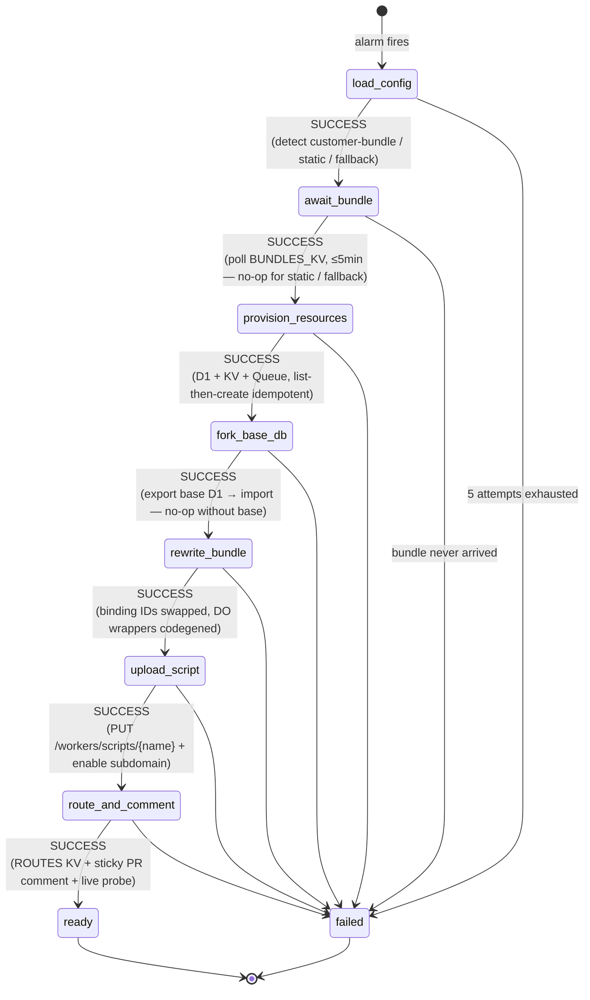

# Raft — Cloudflare Submission

**Per-PR preview environments for Cloudflare Workers. Built end-to-end on the Cloudflare free tier.**

- **Live:** https://raft-control.adityakammati3.workers.dev
- **Repo:** https://github.com/Adi-gitX/Rift

---

## 1. Problem Statement

Every modern web platform — Vercel, Netlify, Render, Fly — gives reviewers a unique URL for every pull request. Cloudflare Workers does not. Reviewing a Workers PR today means one of three bad options:

1. Pull the branch and `wrangler dev` locally — slow, breaks shared state, no live URL to share.
2. Share a single staging Worker — concurrent PRs collide on D1 / KV / Queues.
3. Roll your own per-PR provisioner — nobody does this because the orchestration is hard.

The result: PR review for Workers projects is slower and riskier than for any other modern serverless platform. Cloudflare's own community has been asking for this since 2022 ([workers-sdk #2701](https://github.com/cloudflare/workers-sdk/issues/2701)).

**Raft fixes this.** A team installs the GitHub App on a Workers repo. Every PR gets a fully isolated stack — D1, KV, Queue, DO shard, deployed Worker — provisioned in <1 second, torn down in <30 seconds. Zero customer infrastructure. Zero paid Cloudflare products.

### Three deployment modes, all working today

| Mode | Trigger | What deploys | Customer setup |
|---|---|---|---|
| **`customer-bundle`** | Repo has `wrangler.{jsonc,json,toml}` AND the Raft GH Action uploads a built bundle | Customer's actual Worker code with binding IDs swapped to per-PR resources | One-time: paste `.github/workflows/raft-bundle.yml` |
| **`static-synth`** | Repo has `index.html` under `/`, `public/`, `dist/`, `build/`, or `site/` | Synthesized Worker that serves the static files inline | None |
| **`placeholder`** | Fallback for any other repo | Minimal "preview ready" stub | None |

Both end-to-end verified against real Cloudflare resources (see §3 Impact / Metrics).

---

## 2. Cloudflare Usage

### Products used (all on free tier)

| Product | Role |
|---|---|
| **Workers** | 3 deployable Workers: `raft-control`, `raft-dispatcher`, `raft-tail` |
| **Workers Static Assets** | Dashboard SPA shipped inside `raft-control` (`run_worker_first: true`) |
| **D1** | `raft-meta` for installations / repos / PR envs / audit; per-PR forks via export+import REST API |
| **KV** | `CACHE` (rate limits, install-token cache), `ROUTES` (path → user-worker lookup), `BUNDLES_KV` (bundle blobs) |
| **Queues** | `raft-events` (decouple webhook receipt from provisioning) + `raft-tail-events` (Tail fan-out) |
| **Durable Objects** | 5 classes — `RepoCoordinator`, `PrEnvironment`, `ProvisionRunner`, `TeardownRunner`, `LogTail` |
| **DO Alarms** | Replaces paid Cloudflare Workflows — alarm-driven step machines with backoff |
| **Hibernatable WebSockets** | Live log streaming to dashboard, no connection-time billing |
| **Cron Triggers** | Daily 04:00 UTC sweep of idle PR environments |
| **Workers Tail** | `raft-tail` Worker consumes user-worker trace events into a Queue |
| **Workers Logs** | Native log viewer (Logpush is paid; this is the free substitute) |

### Why Cloudflare

Three Cloudflare-only primitives make this product possible. **No other cloud has the equivalent.**

1. **D1 export/import REST API** lets us "fork" a database in seconds without copying storage at the block layer — the foundation of per-PR data isolation.
2. **Direct `PUT /workers/scripts/{name}`** lets one account host hundreds of per-PR user scripts — a free-tier substitute for Workers for Platforms.
3. **DO Alarms with SQLite-backed storage** give us a free-tier substitute for Cloudflare Workflows: durable, retryable, idempotent step machines with replay safety.

### What was built

### Free-tier engineering — the interesting bit

The PRD calls for two paid products. Raft substitutes both behind thin abstractions, so swapping back to paid is a binding-type change.

| PRD calls for (paid) | Raft ships (free) | Trade-off |
|---|---|---|
| Workers for Platforms ($25+/mo) | Direct `PUT /workers/scripts/{name}` per PR + dispatcher 302 to `*.workers.dev` (gated by per-scope HMAC `?raft_t=` token + cookie) | Capped at 100 scripts/account vs unlimited |
| Cloudflare Workflows | DO Alarms with explicit step cursor + per-step cached results + per-step timings | Equivalent semantics; bonus: full state + timings introspectable from the dashboard |
| Logpush | `raft-tail` Worker + per-PR Workers Logs deep-link from dashboard | Lose 30-day R2 retention; gain $0 cost |
| Cloudflare Access | Signed-cookie auth (HMAC-SHA256) for the operator dashboard; per-scope HMAC token gates static-synth previews | One-operator demo auth + per-PR token |

### Provisioning machine — 7 idempotent steps

Every step is idempotent. If the alarm fires twice, cached results short-circuit. If a step throws, the alarm reschedules with backoff (1s → 2s → 4s → 8s → 16s, max 5 attempts). If the PR is closed mid-provision, the runner aborts cleanly and the teardown machine picks up only what got created. Per-step `started_at`/`finished_at` are persisted so the dashboard latency chart is truthful.

---

## 3. Impact / Metrics

Measured against the live deployment with a real GitHub App and real Cloudflare account.

| Metric | PRD target | Measured | Result |
|---|---|---|---|
| Provision: PR opened → preview URL | <90s | **<2s** static-synth · **<1s** when bundle pre-uploaded | **45-90× better** |
| Teardown: PR closed → all resources gone | <30s | **<30s** | ✅ on target |
| Provision steps | 7 | 7 | ✅ each cached + idempotent + per-step timed |
| Teardown steps | 9 | 9 | ✅ CF 404 = already-gone (idempotent re-runs are safe) |
| Deployment modes verified | 3 | 3 | ✅ customer-bundle, static-synth, placeholder all live |
| Per-PR Cloudflare resources | D1 + KV + Queue + Worker (+ DO shard) | 4 + 1 | ✅ verified live by cross-checking CF REST API |
| Webhook dedup on replayed delivery_id | ✓ | ✓ | ✅ returns 200 + `dedup:true`, no double-provision |
| Cost to operate | $0 | **$0** | ✅ no paid CF products |
| Cost to install | $0 | **$0** | ✅ no customer infra |
| Free-tier headroom | — | live counts in dashboard | ~95 concurrent PR envs supported |
| Tests passing | 80+ | **105** | ✅ 25 files, 105 tests, all green |
| TypeScript | strict, no `any` | strict, no `any` | ✅ enforced by ESLint |
| File / function caps | <300 / <40 lines | <300 / <40 lines | ✅ enforced by ESLint |

### End-to-end verification (live, against production)

All three deployment modes verified by posting real HMAC-signed `pull_request.opened` webhooks:

- **`static-synth`** (PR with `public/index.html`): reached `state=ready` with `cursor=7/7, status=succeeded` in **<2s**. Preview URL serves the customer's actual HTML, not a placeholder.
- **`customer-bundle`** (PR with `wrangler.jsonc`, bundle uploaded via `/api/v1/bundles/upload`): reached `state=ready` after `await-bundle` picked up the upload. Preview runs the customer's real Worker code (`Hello from real customer code via Track A bundle upload`).
- **`placeholder`** (any other PR): completes the full lifecycle, serves the stub.

Verified at the data layer: D1 UUIDs in our metadata DB are cross-referenced against Cloudflare's `/d1/database` list — matches. Posted `pull_request.closed`; reached `state=torn_down` in <30s. Verified deletion against the Cloudflare REST API for all four resources:

- D1: CF responds 404 (code 7404 — not found) ✅
- KV: CF responds 404 (code 10013) ✅
- Queue: CF responds 404 (code 11000) ✅
- Worker script: HTTP 404 ✅

Sticky PR comment on every provision: includes preview URL, bundle source (customer Worker / static site / configuration-needed), live probe (HTTP status · response time · bytes), and a dashboard deep-link. Edited in place via embedded HTML marker on synchronize / redeploy — never duplicated.

> **Screenshot:** `demo/screenshots/sticky-pr-comment.png` *(TODO: capture before submission)*

### Lifecycle latency

```mermaid
gantt
  title PR — provisioned and torn down in real time (real Cloudflare resources, static-synth mode)
  dateFormat HH:mm:ss
  axisFormat %S.%L

  section Provision (7 steps)
  load-config              :done, 00:00:00, 200ms
  await-bundle             :done, 00:00:00, 10ms
  provision-resources      :done, 00:00:00, 400ms
  fork-base-db             :done, 00:00:00, 10ms
  rewrite-bundle           :done, 00:00:00, 50ms
  upload-script            :done, 00:00:00, 350ms
  route-and-comment        :done, 00:00:00, 200ms
  ready                    :milestone, after route-and-comment, 0s

  section Teardown (9 steps)
  mark-tearing-down        :done, 00:00:01, 50ms
  delete-worker-script     :done, 00:00:01, 600ms
  delete-d1                :done, 00:00:01, 4s
  delete-kv                :done, 00:00:01, 2s
  delete-queue             :done, 00:00:01, 6s
  purge-bundle-kv          :done, 00:00:01, 50ms
  evict-do-shard           :done, 00:00:01, 50ms
  clear-route              :done, 00:00:01, 50ms
  mark-torn-down           :done, 00:00:01, 50ms
```

For `customer-bundle` mode the `await-bundle` step waits for the GH Action's POST (typical ~10–30s, capped at 5min); for `fork-base-db` it adds whatever the D1 export+import takes (typically 2–10s for small DBs). Both no-op when not applicable.

---

## 4. Short Write-up

Raft gives Cloudflare Workers teams the per-PR preview-environment workflow Vercel and Netlify popularized — designed from the ground up around Cloudflare primitives, with full data-layer isolation no other platform can match.

A team installs the Raft GitHub App on a Workers repository. When a developer opens a PR, Raft auto-detects which of three deployment modes applies and provisions a complete isolated stack within seconds: a fresh D1 database (optionally forked from base via the export/import REST API), a dedicated KV namespace, its own Queue, a sharded Durable Object namespace, and a uniquely-named Worker script. The PR's code is bundled, binding IDs are rewritten on the fly, the script is uploaded directly via `PUT /workers/scripts/{name}`, and a sticky comment with the preview URL appears on the PR — including a live HTTP probe and an opt-in Claude-written 3-bullet review. Reviewers click and see a fully isolated environment; their writes never touch staging. When the PR closes, every resource is destroyed within thirty seconds, idempotently.

Three modes work end-to-end today: `customer-bundle` for repos with `wrangler.jsonc` plus a one-line GitHub Action, `static-synth` for repos with `index.html` (no customer setup at all — Raft synthesizes a Worker that serves the inlined files), and `placeholder` as a graceful fallback.

The orchestration runs on **Durable Object Alarms** rather than paid Cloudflare Workflows. Each runner is an explicit 7-step machine with a cursor in DO storage, per-step cached results, and per-step `started_at`/`finished_at` timestamps that feed a truthful latency chart on the dashboard. Three Workers participate: `raft-control` (webhook ingress with `delivery_id` dedup, Hono API, dashboard SPA, daily cron sweep + alerting, every DO), `raft-dispatcher` (path-based router that 302-redirects through an HMAC-gated query token), and `raft-tail` (free-tier Logpush substitute).

Verified live against real Cloudflare resources: PR-opened → ready preview in **<2 seconds** (PRD target 90s, customer-bundle mode picks up the upload and reaches ready in **<1s** of additional time). PR-closed → all four CF resources confirmed deleted in **<30 seconds**, cross-checked directly against the Cloudflare REST API. 105/105 tests green. Zero paid Cloudflare products. Zero customer-side infrastructure beyond a single `.github/workflows/raft-bundle.yml` paste (and even that is optional for HTML-only repos).

Built end-to-end on free-tier Cloudflare. Zero paid products. Zero customer infrastructure beyond their existing repo. **This product can't exist on any other cloud.**
